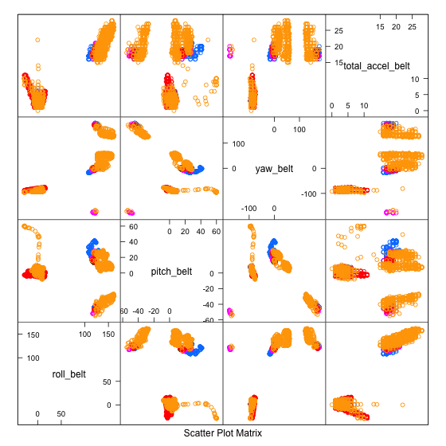
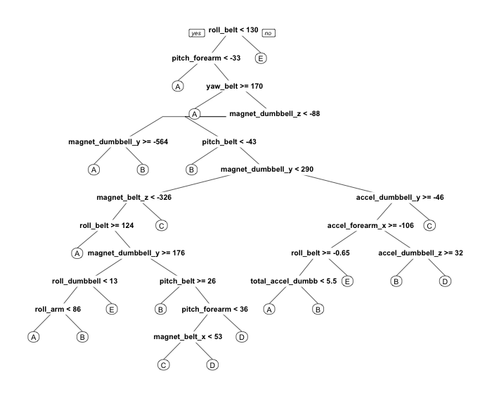

## Introduction

One thing that people regularly do in evaluating effectiveness of physical activity is to quantify how much of a particular activity they do, but they rarely qualiify how well they do it. In this project, we use data from accelerometers on the belt, forearm, arm, and dumbell of 6 participants. Experts graded the activities from A to E (A the best) if the activity was performed well. Our primary goal is to develop the best predictor given over 19000 rows of data and hundreds of features to consider.

* <b>Dataset</b>: <a href="https://d396qusza40orc.cloudfront.net/predmachlearn/pml-training.csv">Training data for this project</a>

* <b>Description</b>: Measurements of aspects of movements of subject captured by accelerometer devices not to quantify but to qualitatively evaluate correct forms of exercise.

There are 160 features in the dataset but only 53 are relevant or have values.
More information about the dataset can be found at:  
<a href="http://groupware.les.inf.puc-rio.br/har">Human Activity Recognition website</a> (see the section on the Weight Lifting Exercise Dataset).

Selected fields are:
<ol>
<li><b>roll_belt</b></li>
<li><b>pitch_belt</b></li>
<li><b>yaw_belt</b></li>
<li><b>total_accel_belt</b></li>
<li><b>gyros_belt_x, gyros_belt_y, gyros_belt_z</b></li>
<li><b>accel_belt_x, accelL_belt_y, accel_belt_z</b></li>
<li><b>magnet_belt_x, magnet_belt_y, magnet_belt_z</b></li>
<li><b>roll_arm</b></li>
<li><b>pitch_arm</b></li>
<li><b>yaw_arm</b></li>
<li><b>total_accel_arm</b></li>
<li><b>gyros_arm_x, gyros_arm_y, gyros_arm_z</b></li>
<li><b>accel_arm_x, accel_arm_y, accel_arm_z</b></li>
<li><b>magnet_arm_x, magnet_arm_y, magnet_arm_z</b></li>
<li><b>roll_dumbbell</b></li>
<li><b>yaw_dumbbell</b></li>
<li><b>total_accel_dumbbell</b></li>
<li><b>gyros_dumbbell_x</b></li>
<li><b>yaw_forearm</b></li>
<li><b>total_accel_forearm</b></li>
<li><b>gyros_forearm_x, gyros_forearm_y, gyros_form_z</b></li>
<li><b>accel_forearm_x, accel_forearm_y, accel_forearm_z</b></li>
<li><b>magnet_forearm_x, magnet_forearm_y, magnet_forearm_z</b></li>
<li><b>classe</b> Classification of the form A-E with A the correct form</li>
</ol>

## Pre-Processing

* Load the dataset into R

* Exclude irrelevant features in the analysis such as row index, user name, various timestamps and those with mostly NA values

* Use the R package <code>caret</code> to partition the data into training, testing and validation (49 percent for training, 21 percent for testing and 30 percent for validation)

### Feature Plot

 

Plotting the first four features as pairs reveal no trends or patterns.

## Analysis

Since our response variable <code>classe</code> is categorical with five values, our best bet is Classification and Regression Trees (CART), Random Forest or multi logistic regression. We'll do CART for its interpretability and decent accuracy and Random Forest for its accuracy.

### Classification and Regression Trees Model

Here is a plot of the CART prediction on the training set.

 

CART model produces accuracy of 0.72 on the training set and 0.70 on the testing set which is decent but not great.

<pre>
# Classification and Regression Trees (CART)
library(rpart); library(rpart.plot)
modCART <- rpart(classe ~ ., data=training)

# Confusion Matrix and Accuracy
table(predict(modCART,training,type="class"),training$classe)
       A    B    C    D    E
  A 2258  226   26  133   88
  B  215 1328  252  162  341
  C   73  166 1267  222  106
  D  171  129   68  951   89
  E   18   12   65  109 1144
  
(2258+1328+1267+951+1144)/9619
[1] 0.7223204

# Predictions to the test set and accuracy
table(predict(modCART,newdata=testing,type="class"),testing$classe)
      A   B   C   D   E
  A 935 101   8  65  26
  B 122 569 120  77 162
  C  48  70 529  94  44
  D  60  52  28 394  38
  E   6   5  33  45 487
  
(935+569+529+394+487)/4118
[1] 0.7076251
</pre>

### Random Forest Model

We specify cross-validation in the Random Forest model with k = 5 and repetitions of 5. It turned out it produces the highest accuracy without overfitting. The accuracy with the training data is 100 percent while the testing data is accurate up to 99 percent.

<pre>
# Random Forest
set.seed(1234)
modRF <- train(classe ~., data=training, method="rf", trControl = trainControl(method="cv",number=5,repeats=5))

# Confusion Matrix and Accuracy
table(predict(modRF$finalModel,training),training$classe)
       A    B    C    D    E
  A 2735    0    0    0    0
  B    0 1861    0    0    0
  C    0    0 1678    0    0
  D    0    0    0 1577    0
  E    0    0    0    0 1768
  
(2735+1861+1678+1577+1768)/9619
[1] 1

# Predictions to the test set and accuracy
table(predict(modRF$finalModel,newdata=testing),testing$classe)
       A    B    C    D    E
  A 1170    6    0    0    0
  B    1  787    5    1    3
  C    0    3  712    8    1
  D    0    1    1  666    4
  E    0    0    0    0  749
  
(1170+787+712+666+749)/4118
[1] 0.9917436
</pre>

### Validation Results

The Random Forest model produces an extremely high accuracy on the training and testing set. It suffices as the predictor on the validation set as evidenced with 99 percent accuracy. It is an overkill or unnecessary to use the Generalized Additive Model method in this case.

<pre>
# Predictions to the validation set
table(predict(modRF$finalModel,newdata=validation),validation$classe)
       A    B    C    D    E
  A 1669   13    0    0    0
  B    5 1121    8    2    2
  C    0    4 1013   10    2
  D    0    1    5  951    3
  E    0    0    0    1 1075
  
(1669+1121+1013+951+1075)/5885
[1] 0.9904843
</pre>

## Conclusion

It is clear from the results that Random Forest model is well-suited and the most accurate model without overfitting to predict how well particpants perform exercises on the scale A to E (A being the most correct) from accelerometers gathered by HAR group. Its only downside as mentioned previously is intepretability and a little bit longer run-time.